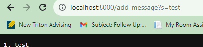
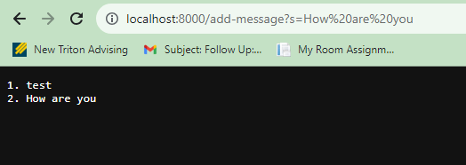
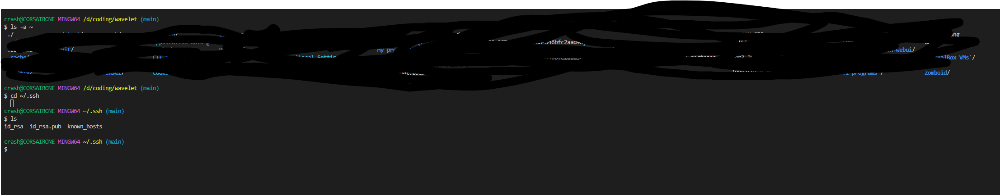
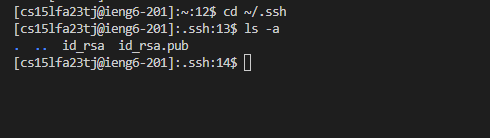
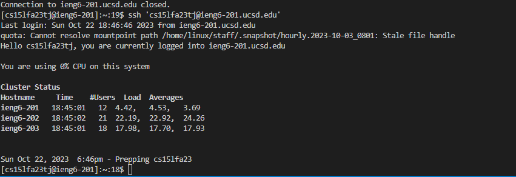

Part 1:


```
import java.io.*;
import java.net.*;
import com.sun.net.httpserver.*;

public class StringServer {
    private static String message = "";

    static class MyHandler implements HttpHandler {
        @Override
        public void handle(HttpExchange t) throws IOException {
            String response = "";
            String path = t.getRequestURI().getPath();

            if (path.equals("/add-message")) {
                String query = t.getRequestURI().getQuery();
                String[] params = query.split("=");
                if (params.length == 2 && params[0].equals("s")) {
                    String newMessage = params[1];
                    message += (message.isEmpty() ? "" : "\n") + (message.lines().count() + 1) + ". " + newMessage;
                    response = message;
                }
            }

            t.sendResponseHeaders(200, response.length());
            OutputStream os = t.getResponseBody();
            os.write(response.getBytes());
            os.close();
        }
    }

    public static void main(String[] args) throws IOException {
        HttpServer server = HttpServer.create(new InetSocketAddress(8000), 0);
        server.createContext("/", new MyHandler());
        server.setExecutor(null); // creates a default executor
        server.start();
    }
}
```

 


 
Method called: handle(HttpExchange t)

Relevant arguments:


t.getRequestURI().getPath() returns /add-message


t.getRequestURI().getQuery() returns s=test


Relevant fields:


message is an empty string at this point.


Changes:


message is updated to "1. test"


 

Method called: handle(HttpExchange t)


Relevant arguments:


t.getRequestURI().getPath() returns /add-message


t.getRequestURI().getQuery() returns s=How%20are%20you


Relevant fields:


message is "1. test" from the previous request.


Changes:


message is updated to "1. test\n2. How are you"


2






3


I gained valuable experience in setting up and running a server, including understanding how to implement specific path behaviors. Additionally, I learned the intricacies of connecting to my school's SSH server.
