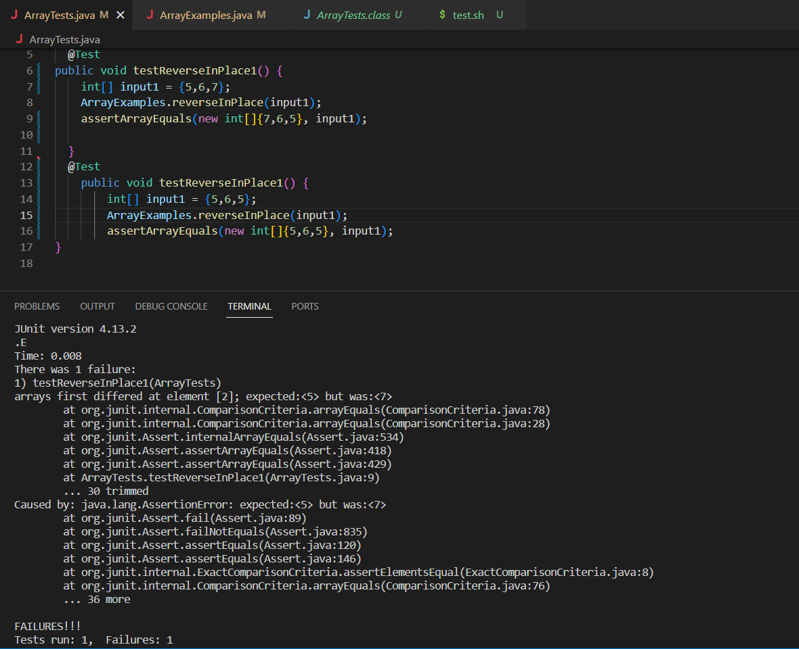

Part 1:

Original code:


```
static void reverseInPlace(int[] arr) {
    for(int i = 0; i < arr.length; i += 1) {
      arr[i] = arr[arr.length - i - 1];
    }
  }
```
Junit Test 
```
@Test 
public void testReverseInPlace1() {
    int[] input1 = {5,6,7};
    ArrayExamples.reverseInPlace(input1);
    assertArrayEquals(new int[]{7,6,5}, input1);
    
	}

1 out of 1 tests, failed. Failure happened as testReversedMultiple(), where expected array {4,3,2,1} but got {4,3,3,4}.

```

input that doesn’t induce a failure
```
    @Test 
    public void testReverseInPlace1() {
        int[] input1 = {5,6,5};
        ArrayExamples.reverseInPlace(input1);
        assertArrayEquals(new int[]{5,6,5}, input1);


JUnit version 4.13.2
.....
Time: 0.008

OK (5 tests)    
```


The symptom:


 


Before and After :
```
//before

static void reverseInPlace(int[] arr) {
    

    for(int i = 0; i < arr.length; i = i+1) {
       
      arr[i] = arr[arr.length - i -1];
      
    }
  }

//after
static void reverseInPlace(int[] arr) {
    int arrt[]=arr.clone();

    for(int i = 0; i < arrt.length; i = i+1) {
       
      arr[i] = arr[arr.length - i -1];
      
    }
  }
```
The fix adresed the issue that the original array was writing over itself with iteself. i fixed thi by copying the array to a new array and useing that to overwrite the original array.

 
2.
Ill chose the find command 

Option 1: -type

This option allows you to specify the type of file you want to search for, such as regular files (f), directories (d), symbolic links (l), etc.

Example 1: Finding all directories in the current directory.

```
find docsearch/technical -type d
```
Output:
```
docsearch/technical
docsearch/technical/911report
docsearch/technical/biomed
docsearch/technical/government
docsearch/technical/government/About_LSC
docsearch/technical/government/Alcohol_Problems
docsearch/technical/government/Env_Prot_Agen
docsearch/technical/government/Gen_Account_Office
docsearch/technical/government/Media
docsearch/technical/government/Post_Rate_Comm
docsearch/technical/plos
```


This command uses the -type d option to search for directories within the ./technical directory. It's useful for quickly identifying and listing all directories, which can be handy for navigation or management tasks.


Example 2: Finding all Python files in the current directory.
```
find docsearch/technical -type f -name "*.py"
```
Output:
```


```
By combining -type f to specify regular files and -name "*.py" to filter by extension, this command identifies all Python scripts within ./technical. It's useful for targeting specific types of files for tasks like code analysis or batch processing.


Source:https://man7.org/linux/man-pages/man1/find.1.html


Option 2: -mtime

This option allows you to search for files based on their modification time.

Example 1: Finding files modified within the last 7 days

```
find ./technical/911report -mtime -7
```
Output:
```
$ find ./technical/911report -mtime -7
./technical/911report
./technical/911report/chapter-1.txt
./technical/911report/chapter-10.txt
./technical/911report/chapter-11.txt
./technical/911report/chapter-12.txt
./technical/911report/chapter-13.1.txt
./technical/911report/chapter-13.2.txt
./technical/911report/chapter-13.3.txt
./technical/911report/chapter-13.4.txt
./technical/911report/chapter-13.5.txt
./technical/911report/chapter-2.txt
./technical/911report/chapter-3.txt
./technical/911report/chapter-5.txt
./technical/911report/chapter-6.txt
./technical/911report/chapter-7.txt
./technical/911report/chapter-8.txt
./technical/911report/chapter-9.txt
./technical/911report/preface.txt
```

Using -mtime -7, this command locates files that have been modified within the last week. This is helpful for tracking recent changes or managing files based on their activity.


Example 2: Finding files modified exactly 10 days ago.
```
find ./technical/911report -mtime 10
```
Output

```

```


With -mtime 10, this command pinpoints files modified exactly ten days prior. It's useful when you need to locate files with precise modification timestamps for tasks like backup management.


Source:https://www.geeksforgeeks.org/find-command-in-linux-with-examples/


Option 3: -size

This option allows you to search for files based on their size.

Example 1: Finding files larger than 300 kB.

Input:
```
$ find ./technical -size +300k
```

Output:
```
./technical/government/Gen_Account_Office/d01591sp.txt
./technical/government/Gen_Account_Office/Statements_Feb28-1997_volume.txt	
```


By employing -size +300k, this command identifies files larger than 300 kilabites ./technical. It's useful for managing disk space or locating large files that may need special handling.


Exsample 2 Finding files less than 1 kilibyte.

Input:
```
find ./technical -size -1k

```

Output:
```

```

By employing -size -1k, this command identifies files smaller than 1 kilabites ./technical. It's useful for managing disk space or locating large files that may need special handling.

Example 7: Finding and deleting all .txt files.
Source:https://linuxize.com/post/linux-find-command/

Option 4: -exec

This option allows you to execute a command on the files found by find.

Example 1: Finding and deleting all .txt files.

```
find ./technical -type f -name "*.txt" -exec rm {} \;
```

Output:
```
deletes all txt files in dir
```


Combining find with -exec rm {} \;, this command locates and deletes all .txt files within ./technical. It's useful for batch operations, such as cleaning up specific file types.


Exsample 2: 	Finding and counting the number of directories.


Input:

```
find ./technical -type d -exec echo {} \; | wc -l
```


Output:
```
11
```

By using -type d in combination with -exec echo {} \;, this command identifies and counts directories within ./technical. This can be useful for generating reports or understanding the directory structure.

Source:https://www.howtoforge.com/tutorial/linux-search-files-with-find-command/


