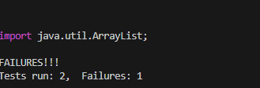

4:
```
<up><up><up><up><enter>
```


5:
```
git clone <ctrl><v>
```


6:
```
<up><up><up><up><enter>
```



7:
z
```
<up><up><up><up><enter>
```
8:
```
:$?1?s/1/2 <Enter>
:wq <Enter>
```


9:

```<up><up><enter>```

